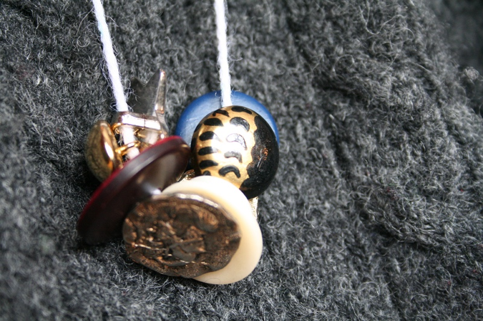

+++
title = "a necklace"
date = 2009-03-11
draft = false
cover = ""
tags = ["Family"]
+++

He tried the yarn's length around my neck after each trim, over and over again. I put Fray Check on the end of the yarn to keep it from unraveling and told him I wasn't peeking. His little man[...]
