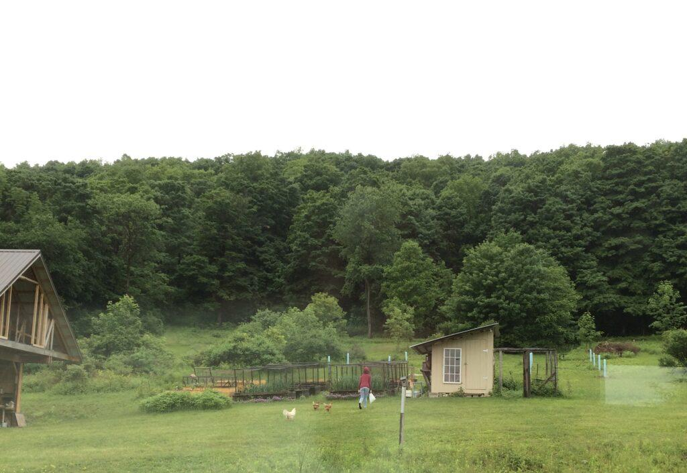
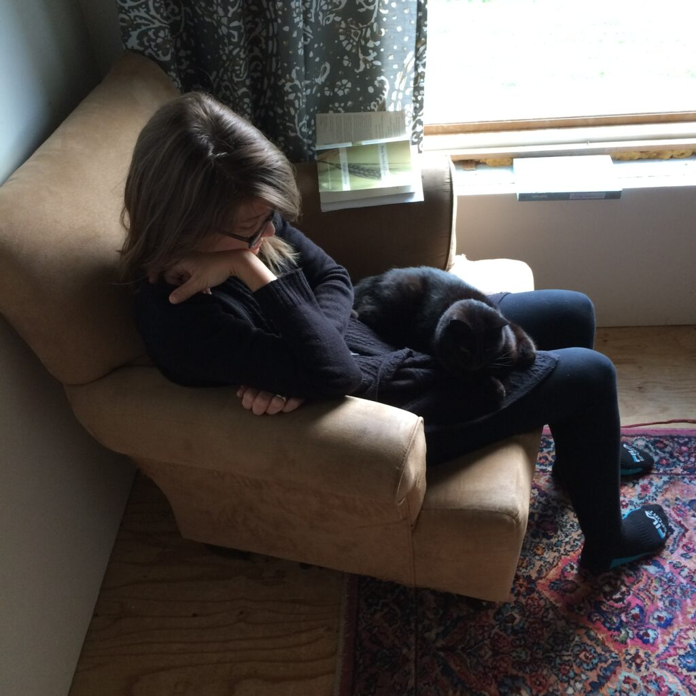
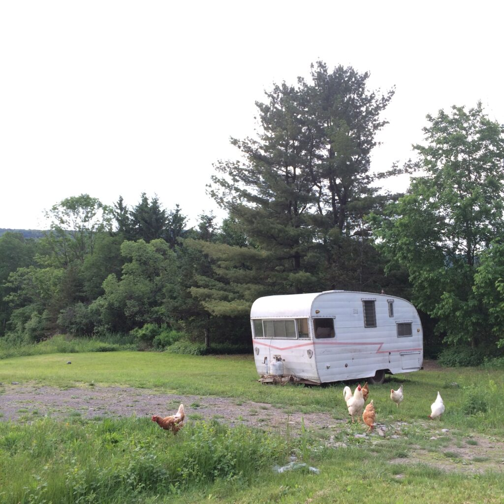
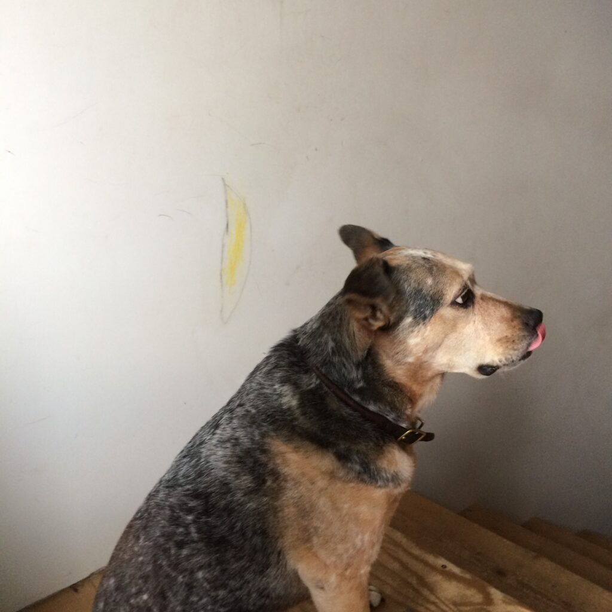
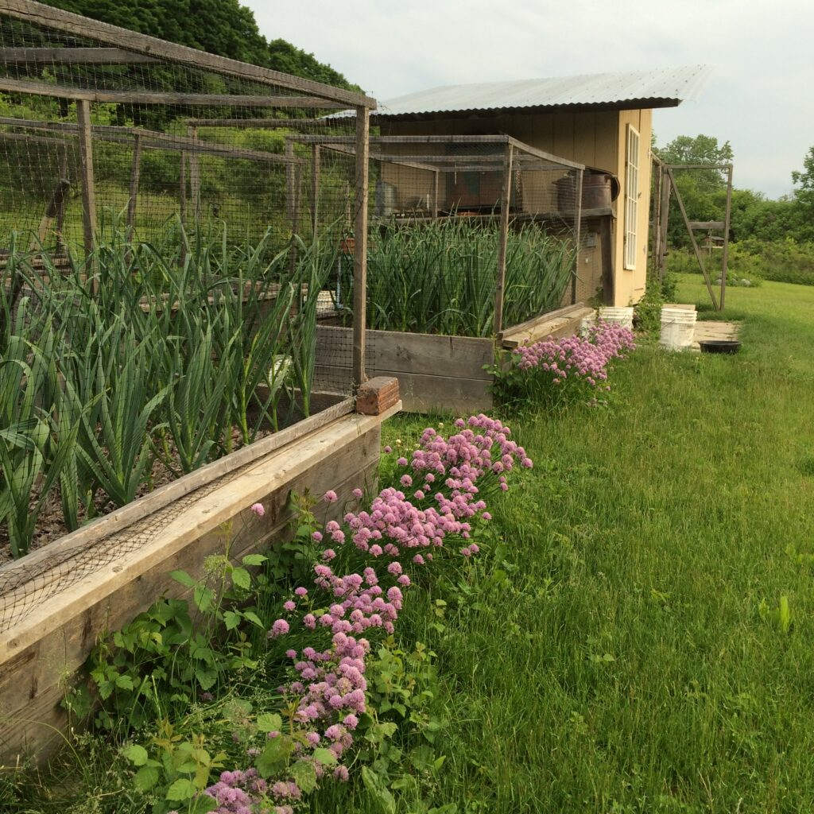
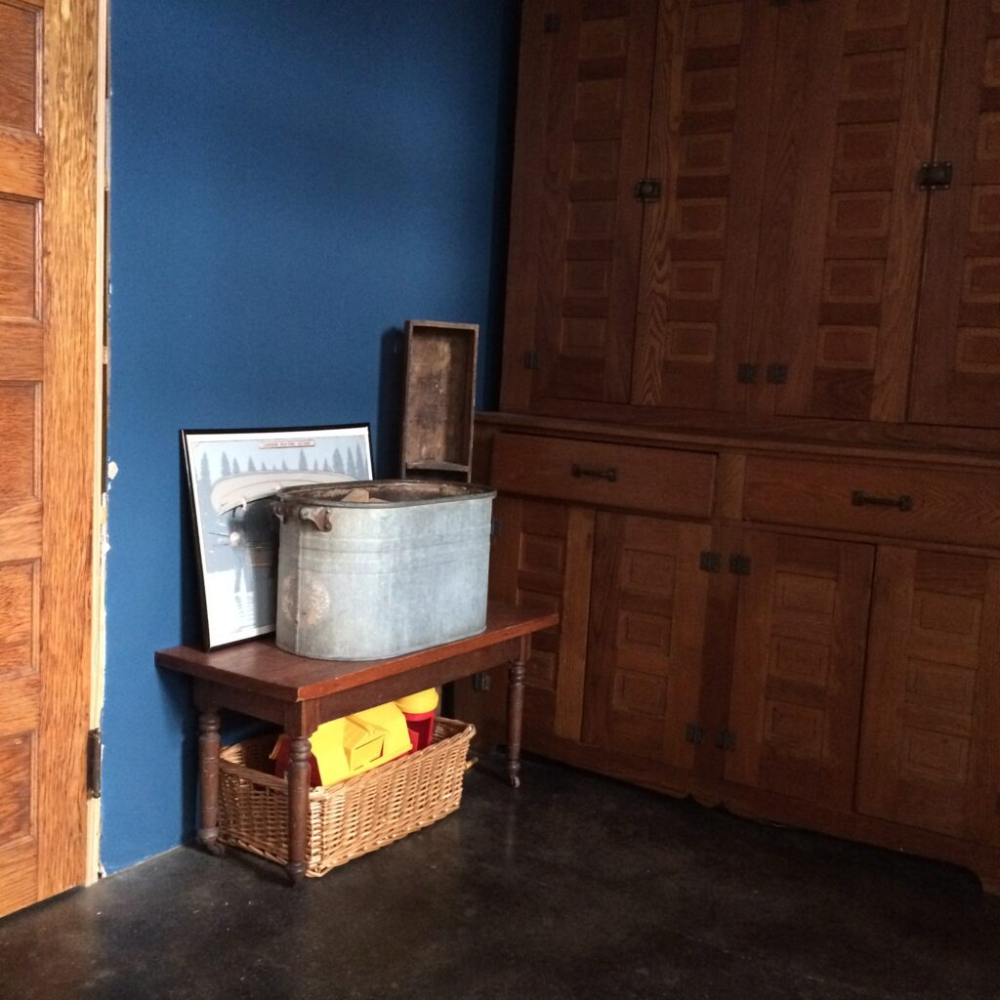
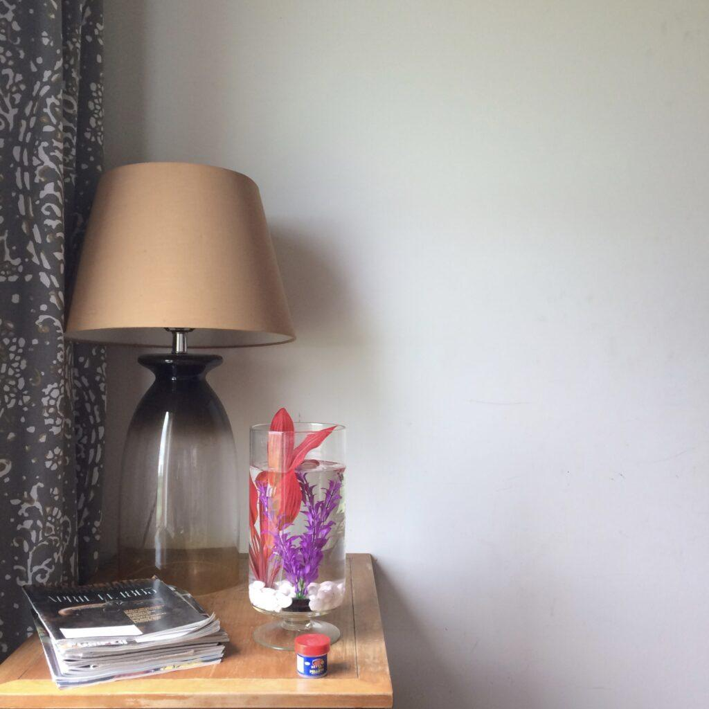
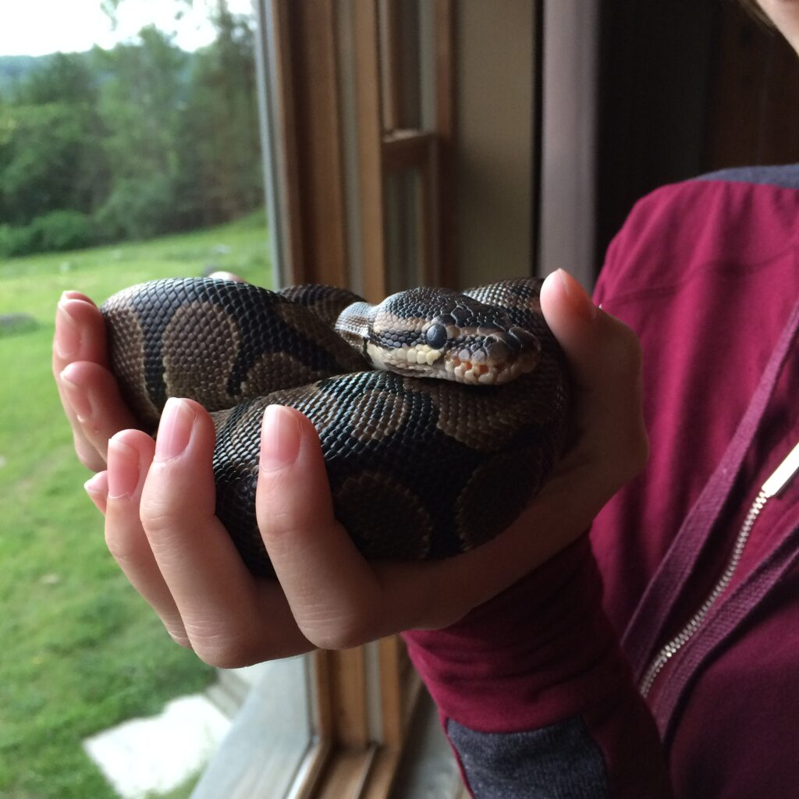
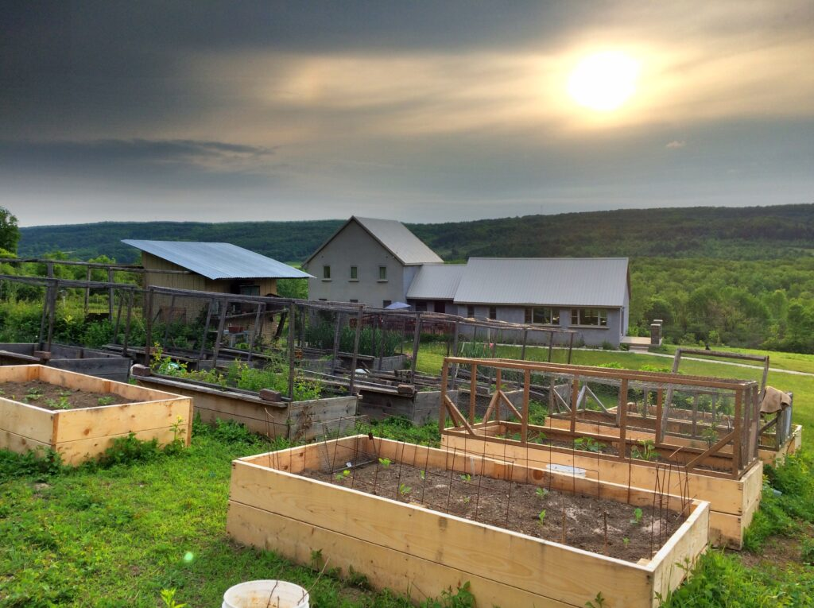

+++
title = "at erica's"
date = 2016-06-21
draft = false
tags = ["Family", "Friends", "Outside", "Thoughts", "Travel"]
+++

I text her a photo: pictures of her life hang from clothespins on my kitchen wall.

"It cracks me up that you took pics of all of the messy places," she texts.

"Those are all of the beautiful places," I text back.

And it's true. Every corner of her home held beauty. All things burst green with the late northern spring in the Oran Valley. We stayed at her place even though she was away, but her family memb[...]

Bruce gathered eggs from the hens' favorite corner of the barn (why they don't lay in their coop, no one understands, but chickens are complicated people) and served them up for our Saturday m[...]

And then there were those chickens. I couldn't stop myself–I took about 900 pictures of chickens that weekend. Why? I have no idea, but who *wouldn't* take pictures of giant pet birds that w[...]

When we were away from the house doing family things, attending the events for which we'd made the trip north in the first place, we talked about what Tilly, Monty, Jag and the chickens might be[...]

Weeks later, I stand in the kitchen while the tulsi steeps. I reach out and touch each picture and remember sweet birdsong, the squeak of trampoline springs, the crack of a bonfire, the quiet of a[...]
