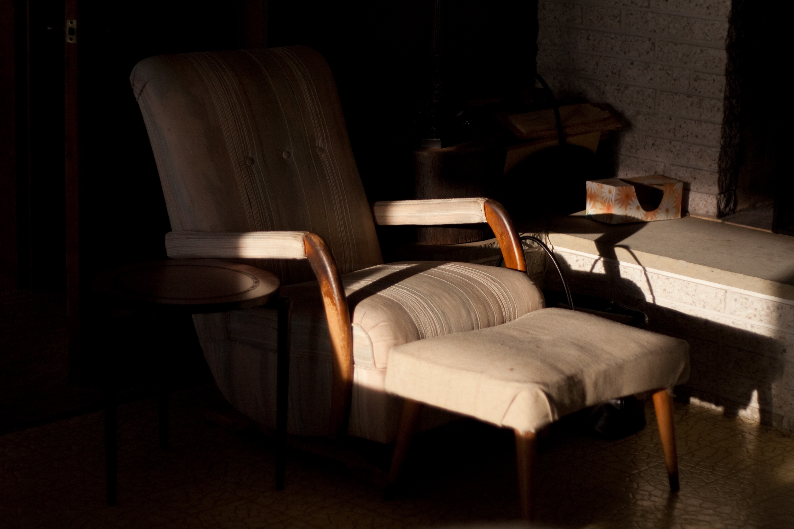

+++
title = "beach house | ellen’s corner"
date = 2010-04-21
draft = false
tags = ["Travel"]
+++

John’s late grandmother would sit here in her Jordache cut-offs and read in the evenings, her feet propped up on the ottoman and a glass of watered-down wine beside her. At low tide, a warm breeze would come to her through the sliding glass door, smelling of muck and mussels and ruffling the pages of her book.
