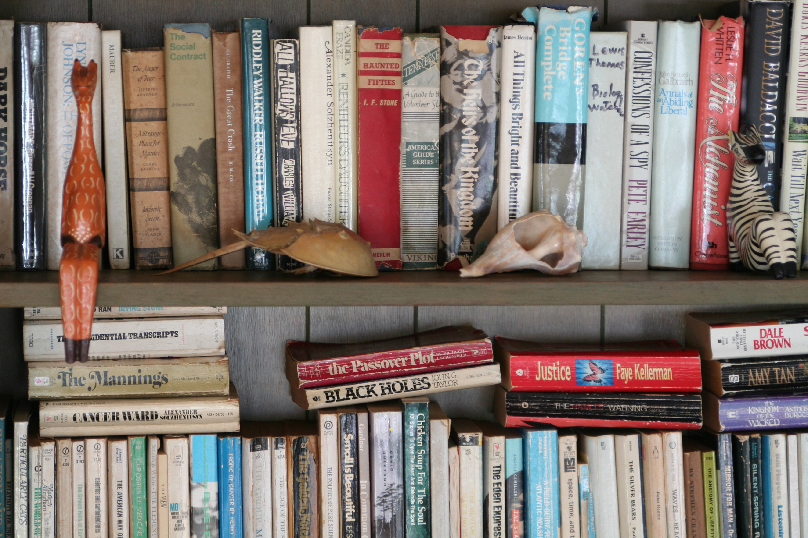

+++
title = "beach house | the book shelf"
date = 2017-12-16
draft = false
tags = ["Thoughts"]
+++

This book shelf is a crazy mix of random paperback novels and obscure hardcover biographies from the 60’s. No matter how many times I stare at this shelf, I always seem to find a selection I hadn’t seen before, and so I pull it odown and thumb through its crumbly pages. Then little bugs skitter across the letters and I sort of freak out, and that’s the end of that. But there is one bug-free book I come back to again and again, a selection of Thoreau’s writings accompanied by photographs by Eliot Porter.
