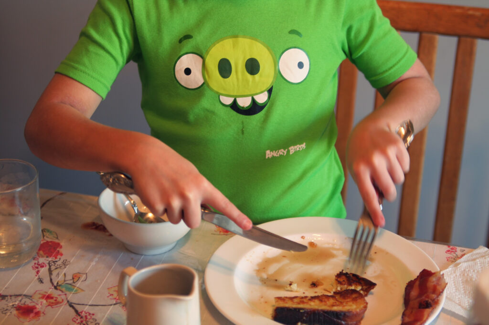
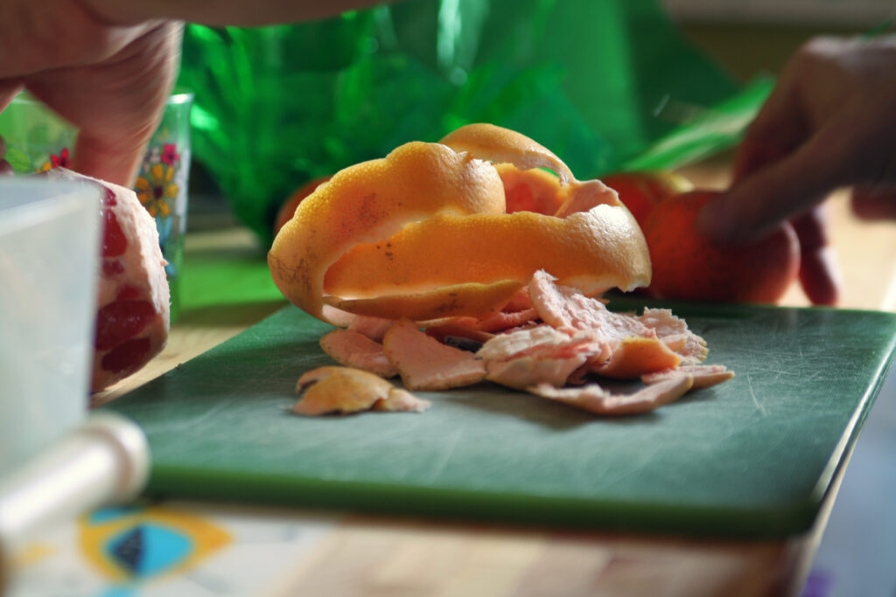

+++
title = "christmas day 2012"
date = 2012-12-28
draft = false
tags = ["Family", "Food", "Occasions"]

[cover]
  image = "image-01.jpg"
  relative = true
+++

Pre-dawn whispers (I stuffed my head under a pillow and went back to sleep).

Presents opened before the eight o’clock hour.

Hot coffee from the Chemex.

Sweet, soft challah French toast eaten continental style by a bad piggie.

Organic, fresh-pressed juice to cut through the sweet.

[Beautiful music](http://www.weta.org/fm) streaming through the house.

Gentle, quiet focus on a [new art](http://www.amazon.com/Spiral-Draw-Klutz-Doug-Stillinger/dp/0545459923).
