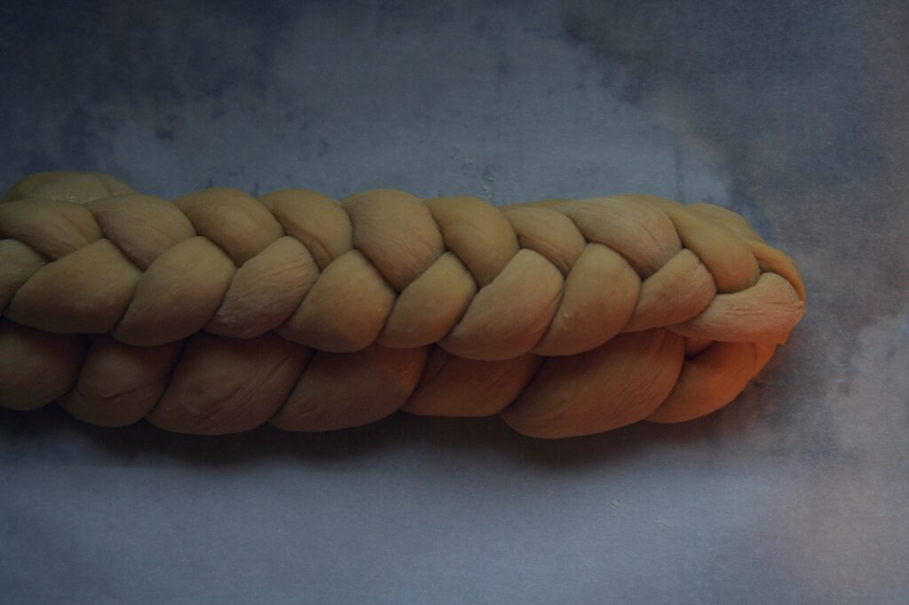
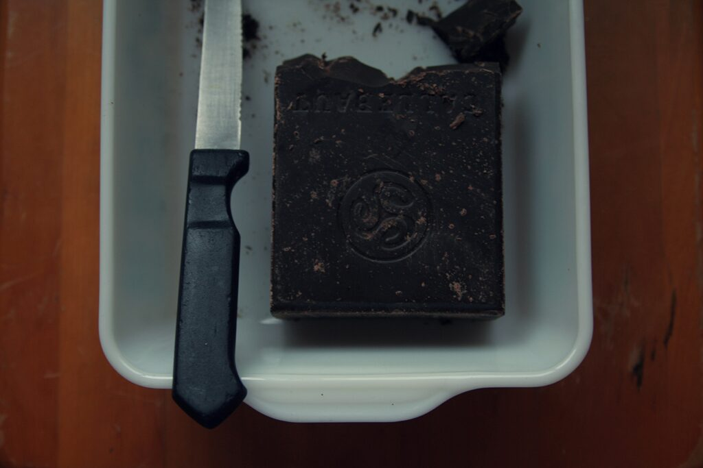
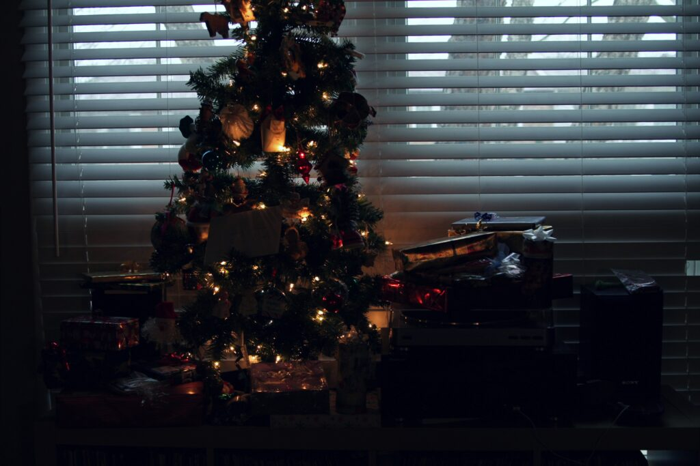

+++
title = "christmas eve 2012"
date = 2012-12-27
draft = false
tags = ["Family", "Food", "Occasions"]

[cover]
  image = "image-01.jpg"
  relative = true
+++

For the first time, my girl helped braid the challah, her small fingers gently moving the ropes and curling in ends. We used the knife as a chisel and popped chunks of Callebaut in our mouths while we worked.

The challah baked up quick. We left the hot loaf to cool on a wire rack and drove to church, where I sat on the edge of my seat as our pastor hit all the high notes in *O Holy Night*. Once home I sat in my bent wood chair under my mother’s cable-knit afghan and stared at the lights on the tree.
