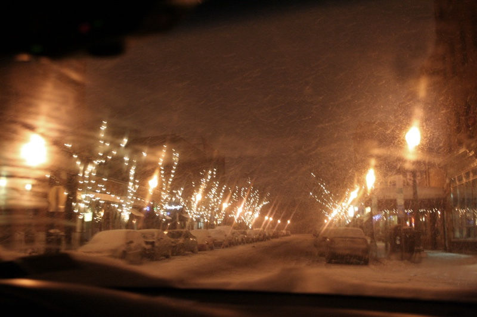
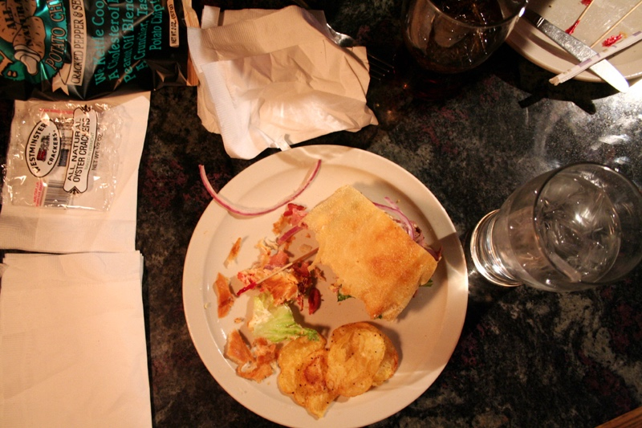
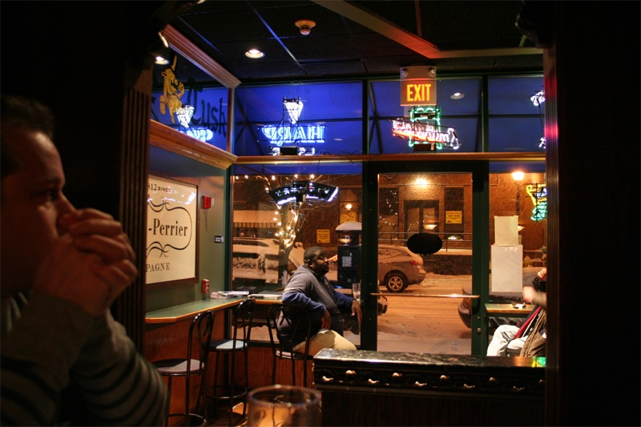
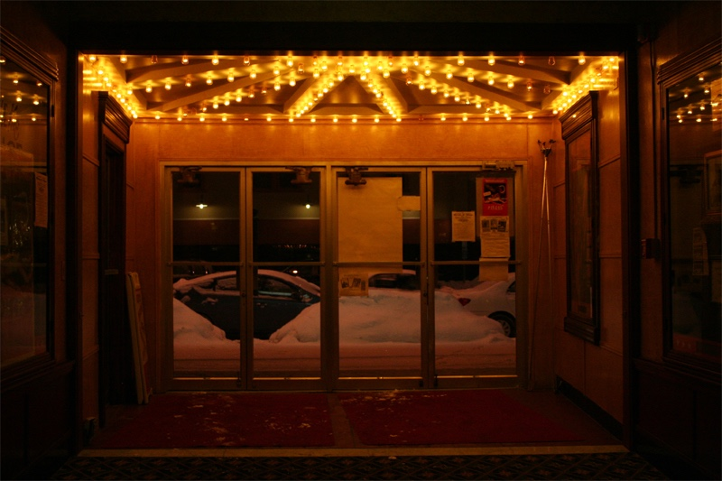
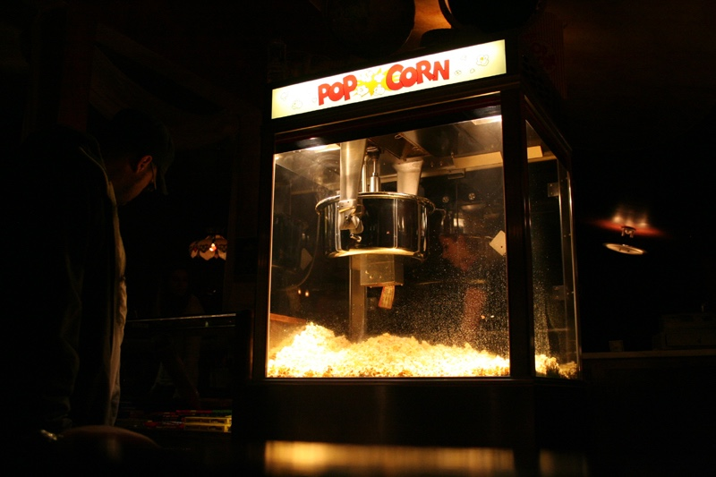

+++
title = "date night"
date = 2009-01-11
draft = false
tags = ["Around Town", "Family", "Occasions"]

[cover]
  image = "image-06.jpg"
  relative = true
+++

We had a lovely Saturday night date during a big snowstorm: sandwiches at [The Blue Tusk](http://www.bluetusk.com/), followed by a \$5 movie at [The Palace Theater](http://www.palacetheatresyracuse.com/). I wish I had known that The Palace doesn’t actually *heat* the theater in winter. I watched most of the movie sitting sideways in my seat, my stockinged feet in John’s hands and the rest of me buried deep inside my down jacket.
