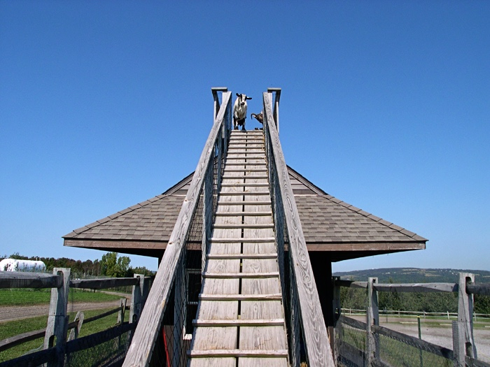
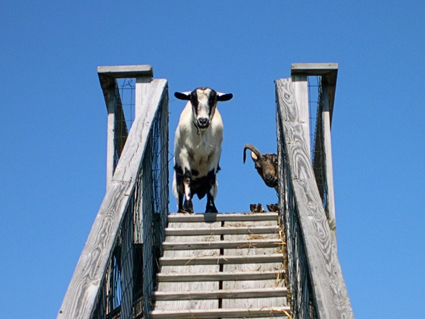
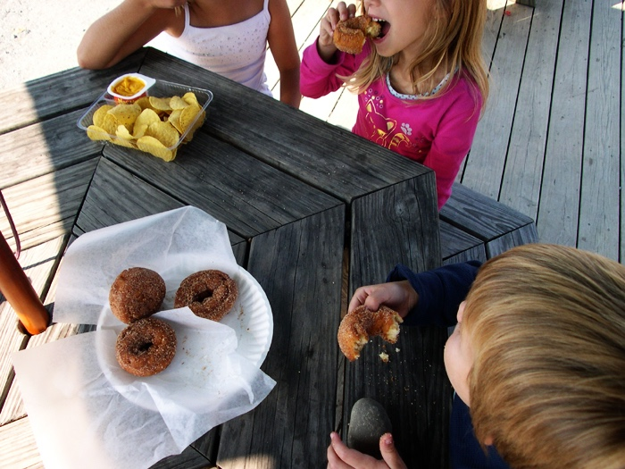
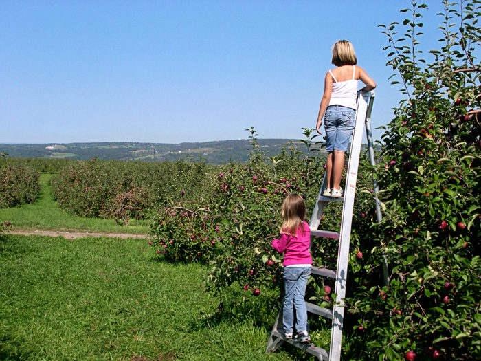
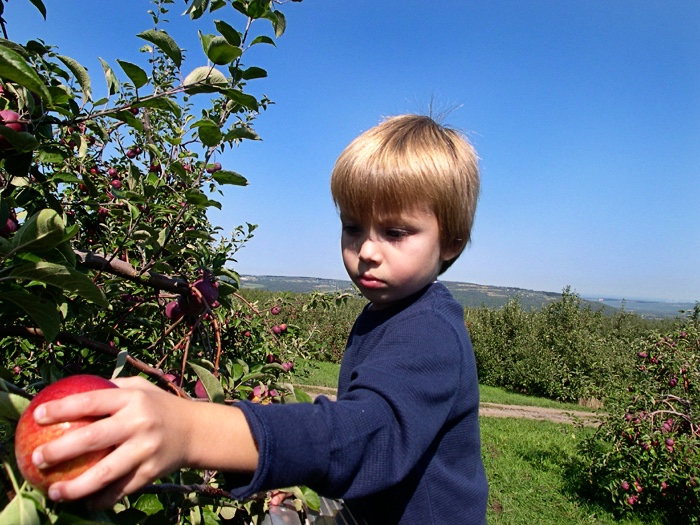

+++
title = "goats on a roof"
date = 2008-09-25
draft = false
tags = ["Around Town", "Friends", "Outside"]

[cover]
  image = "image-03.jpg"
  relative = true
+++

\
\
\

Funniest conversation overheard:\
\
Abbie: “Wow, you can see the whole world from up here!”\
Jocelyn: “Can you see *Italy*???”

