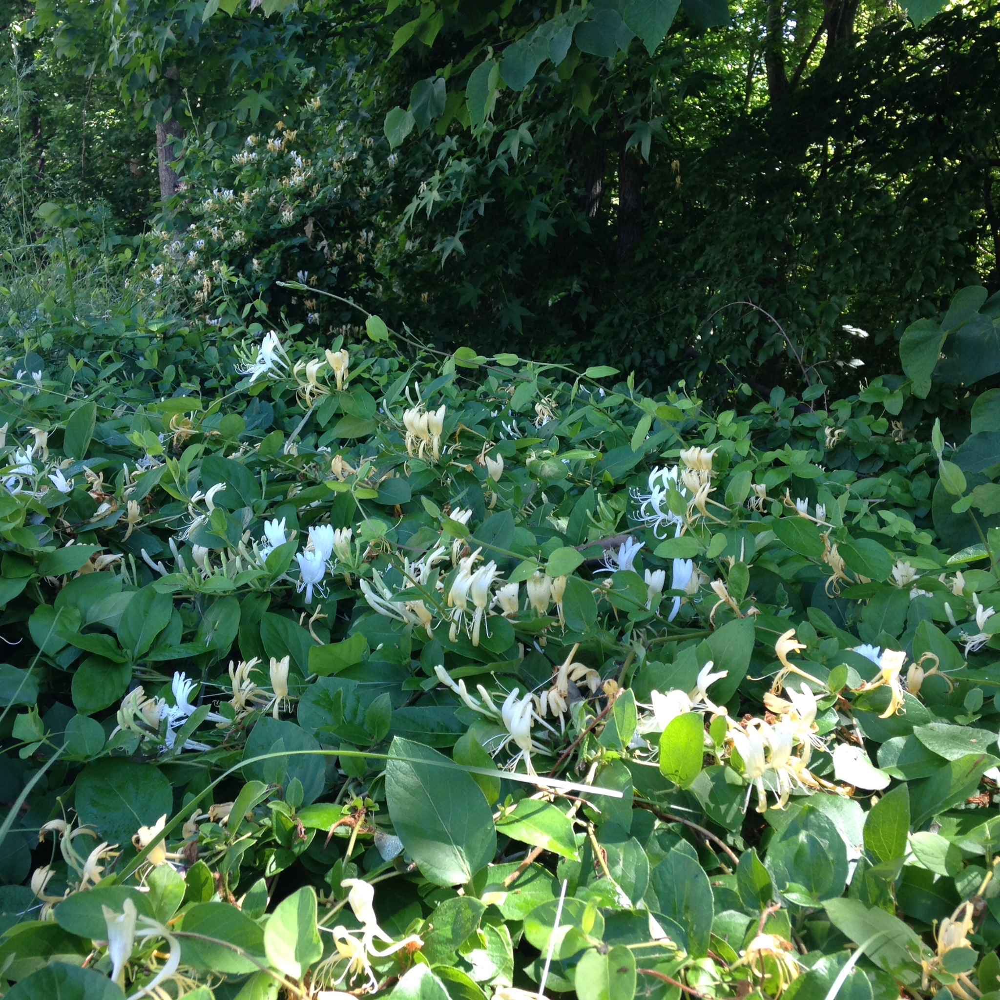
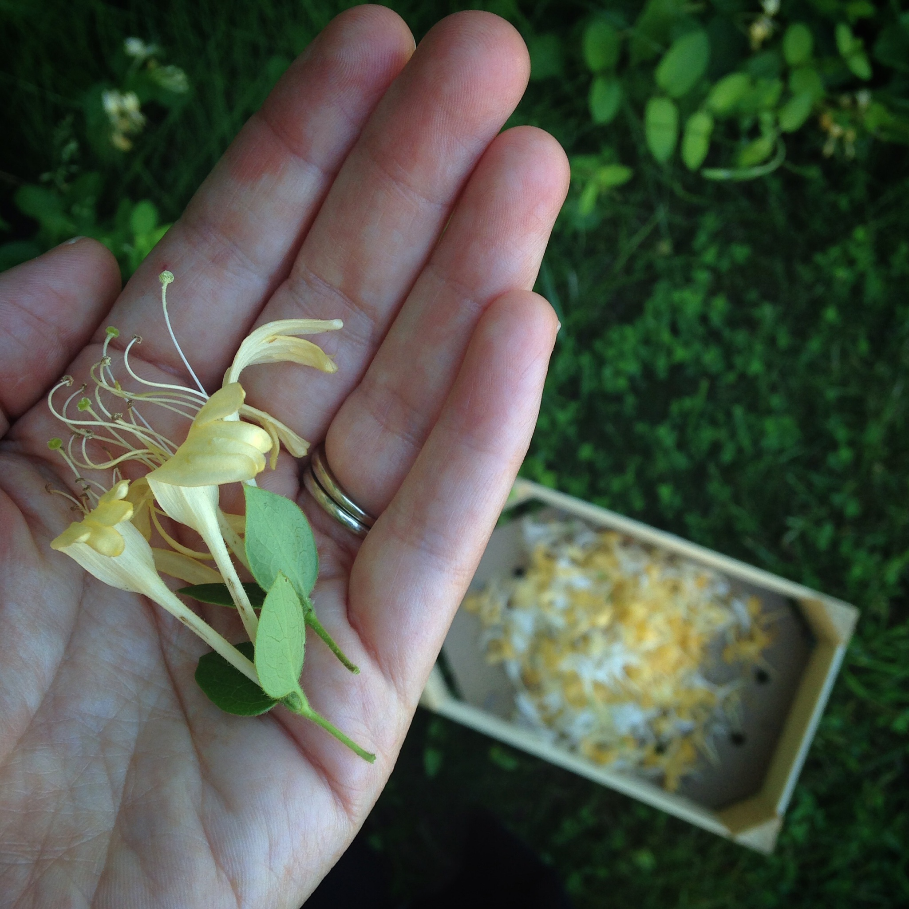
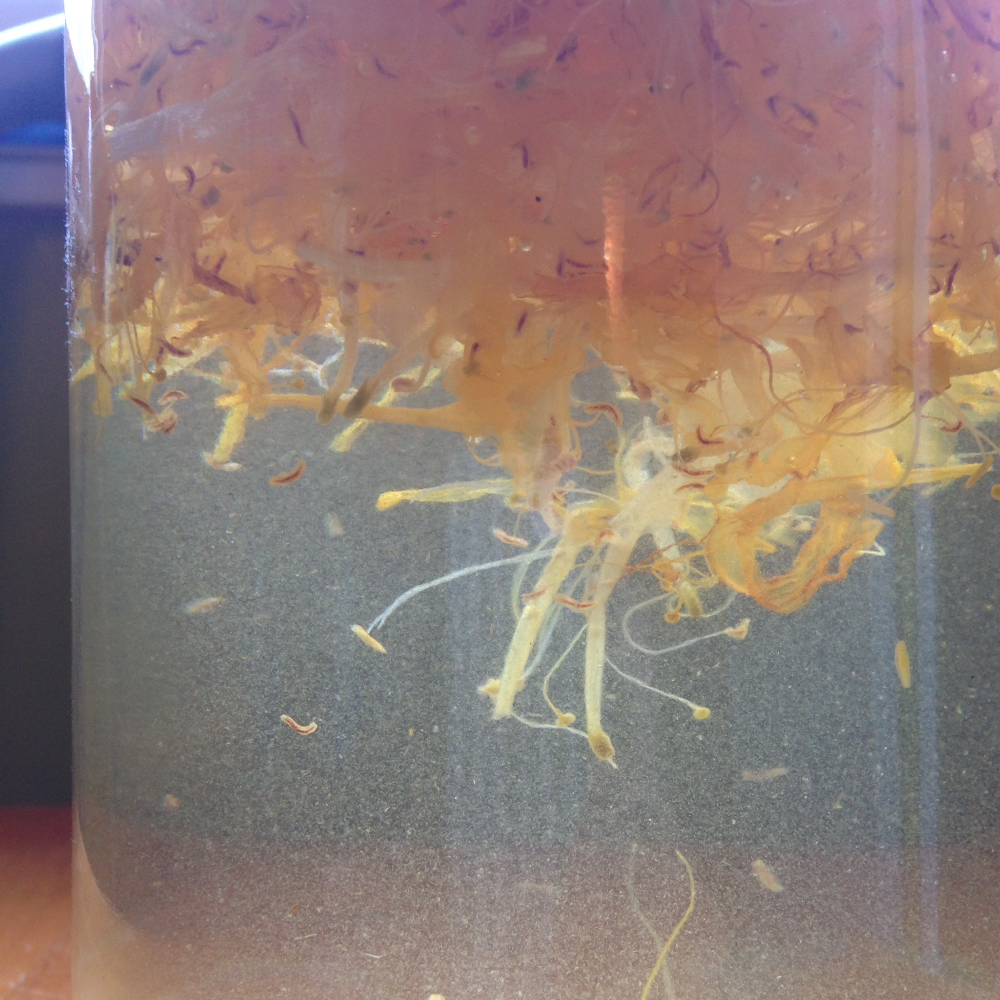
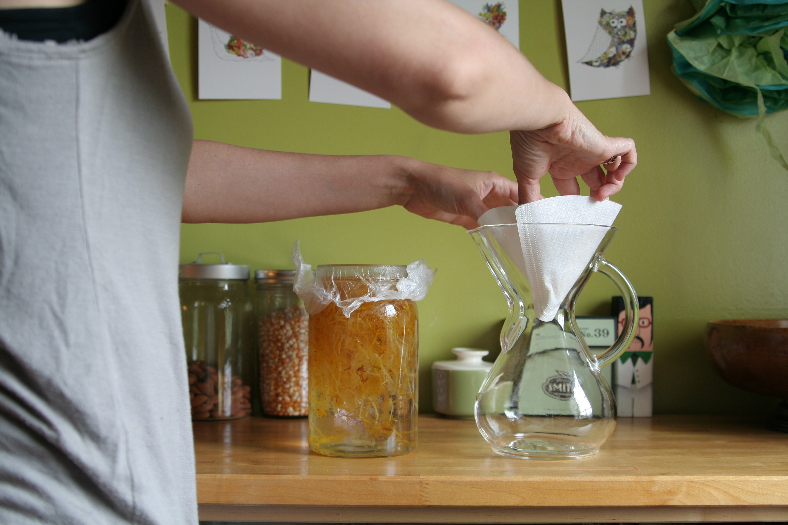
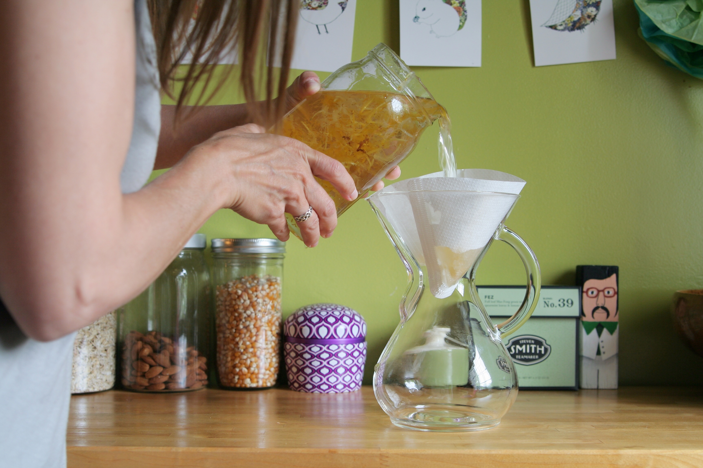
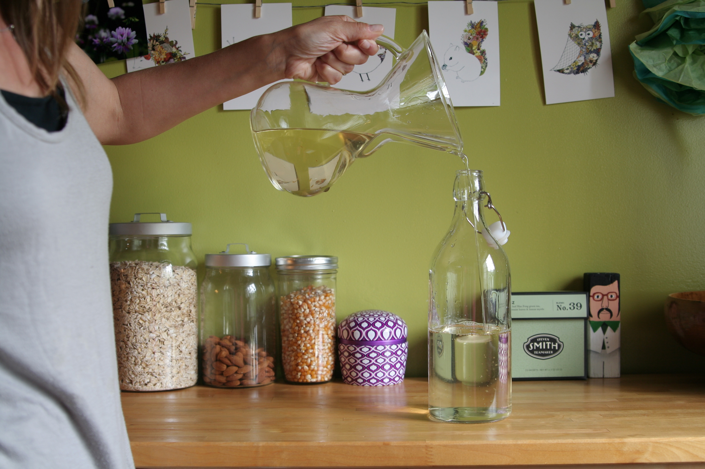

+++
title = "honeysuckle syrup"
date = 2014-06-11
draft = false
tags = ["Food", "Home"]

[cover]
  image = "straining-small-batch-homemade-honeysuckle-syrup-with-the-chemex_14192073669_o.jpg"
  relative = true
+++

My girl and I walked between buildings in our townhouse development and found a patch of fragrant honeysuckle at the edge of the woods. I washed the blossoms, then steeped them overnight in simple syrup. The syrup is lovely mixed with soda water, poured over ice with a squeeze of lemon or sprig of mint.

