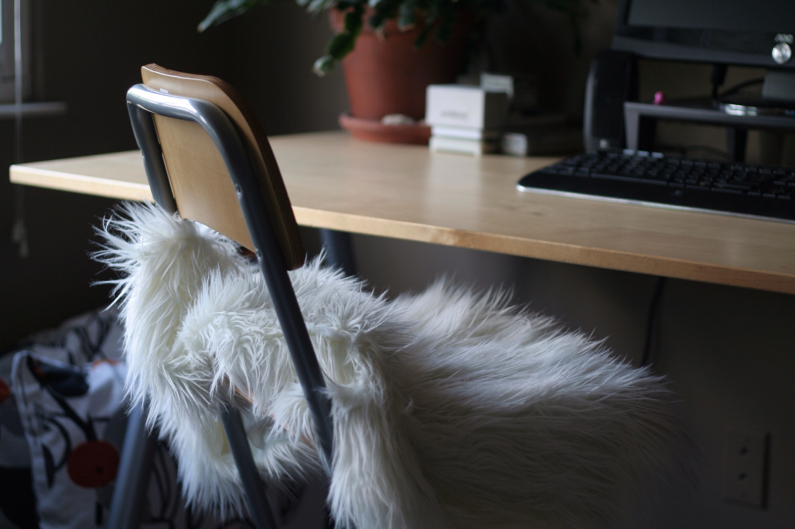
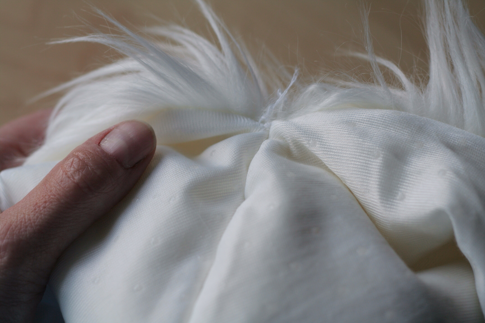
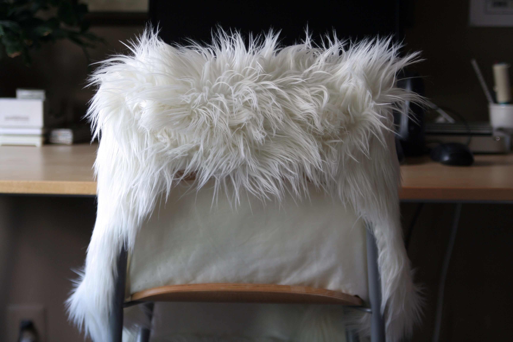

+++
title = "ikea tejn+franklin hack"
date = 2014-05-16
draft = false
tags = ["Crafting", "Home"]

[cover]
  image = "ikea-tejn-franklin-hack-after_14201670544_o.jpg"
  relative = true
+++

Not a fancy hack at all, just functional and needed. I love the look of IKEA’s [faux sheepskin rug TEJN](http://www.ikea.com/us/en/catalog/products/30229077/) draped over my FRANKLIN stool, but it never wanted to stay in place. I had to reposition the thing fifteen zillion times a day. The fifteen zillion and oneth time I pulled the fake fur up and over the seat back, I noticed that the edges matched up pretty well on both sides of the pointy end. I threaded a large needle with thick polyester-covered cotton thread, sewed the edges together on both sides, and made a pocket out of the entire end of the skin. The rug still drapes well but no longer slides off of the back rest.

