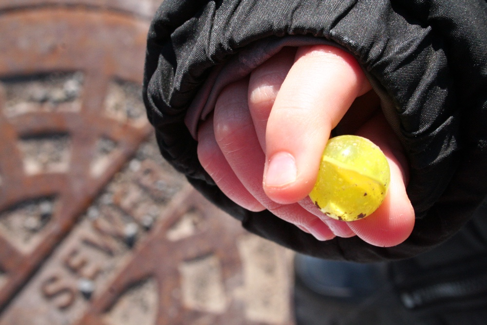
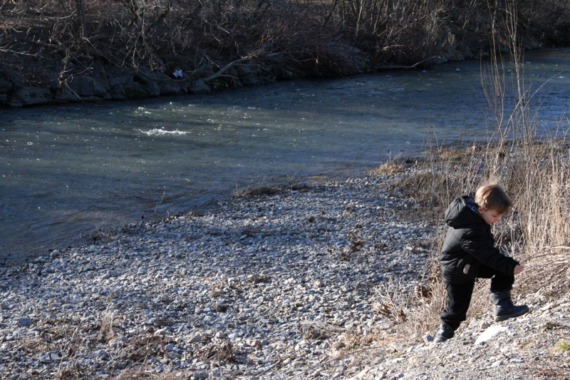
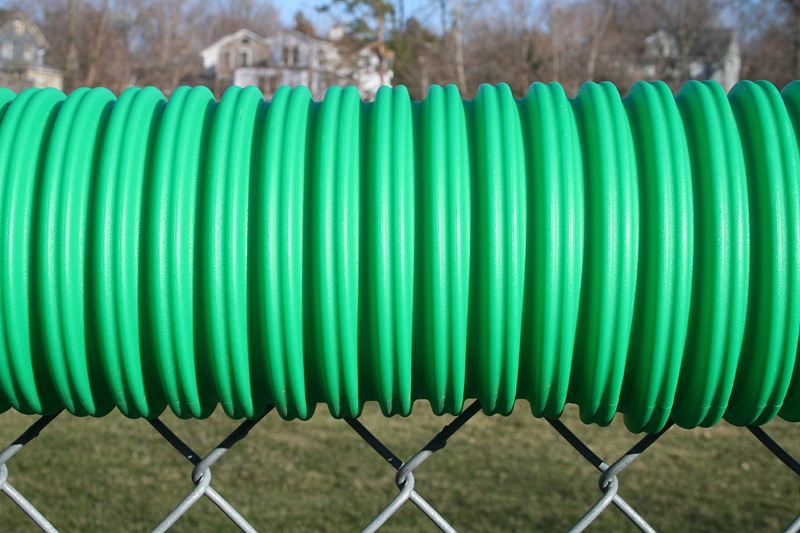
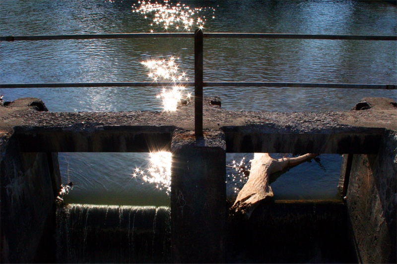
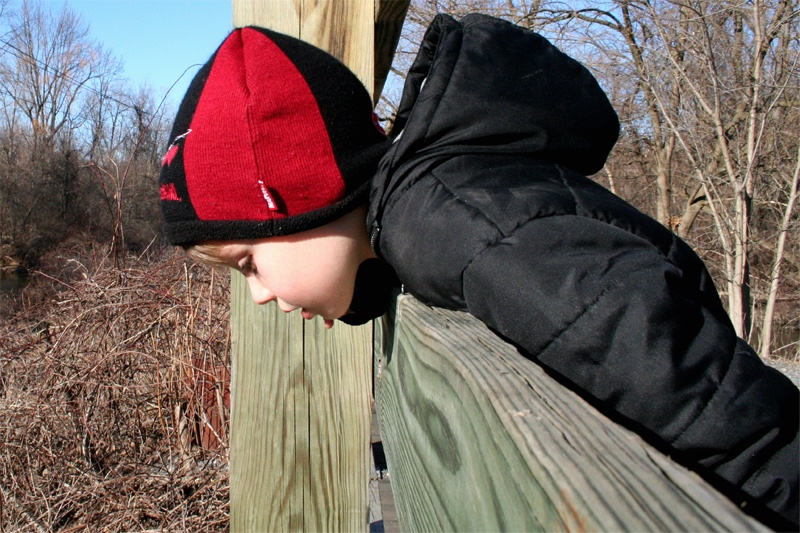
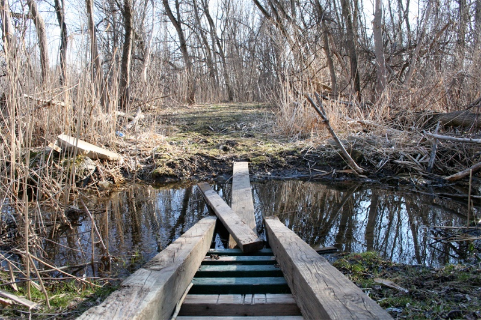
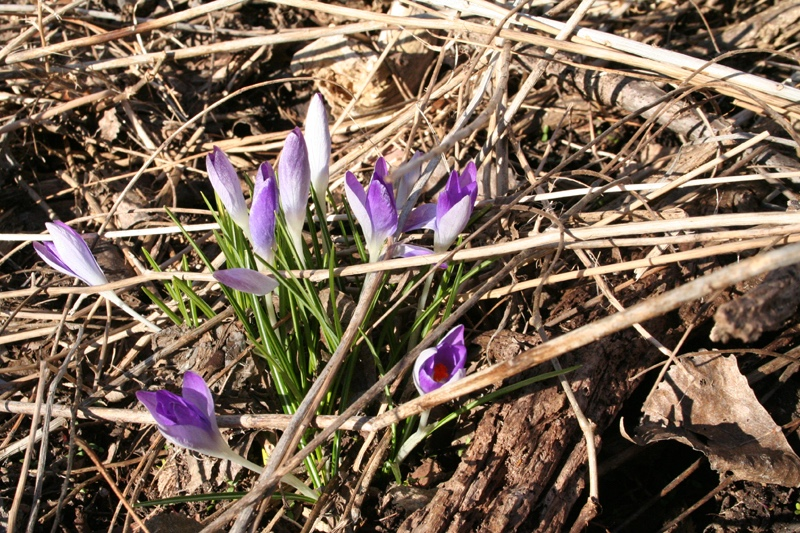

+++
title = "in which we hunt for colour"
date = 2009-03-23
draft = false
tags = ["Family", "Outside"]
+++

> *“Before beginning a hunt, it is wise to ask someone what you are looking for before you begin looking for it.” – Winnie the Pooh*

Things here are still brown and gray, so we hearty Northern types have to hunt for Colour in March. We found a marble, played Pooh Sticks, collected rocks, and endured A Perilous Crossing. I think five is my favorite age.
