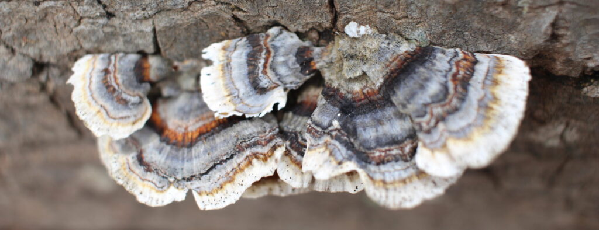

+++
title = "lake, sky, woods"
date = 2015-02-10
draft = false
tags = ["Outside"]
+++

I leave the trail and follow a narrow deer path along the shoreline to a small, sheltered cove.

I stand very still in sparse underbrush and listen to voices echo across the water.

I drop to my knees in the middle of a stand of hardwoods.

I bring my face close to moss, bugs and fallen leaves.

I hover over clusters of soft, grey mushrooms.

I stare too long at a patch of sunlight on bark.

I lose hours to the forest.

I wear the woods home:

dirt on my knees,

burrs in my hair,

mud on my boots.
