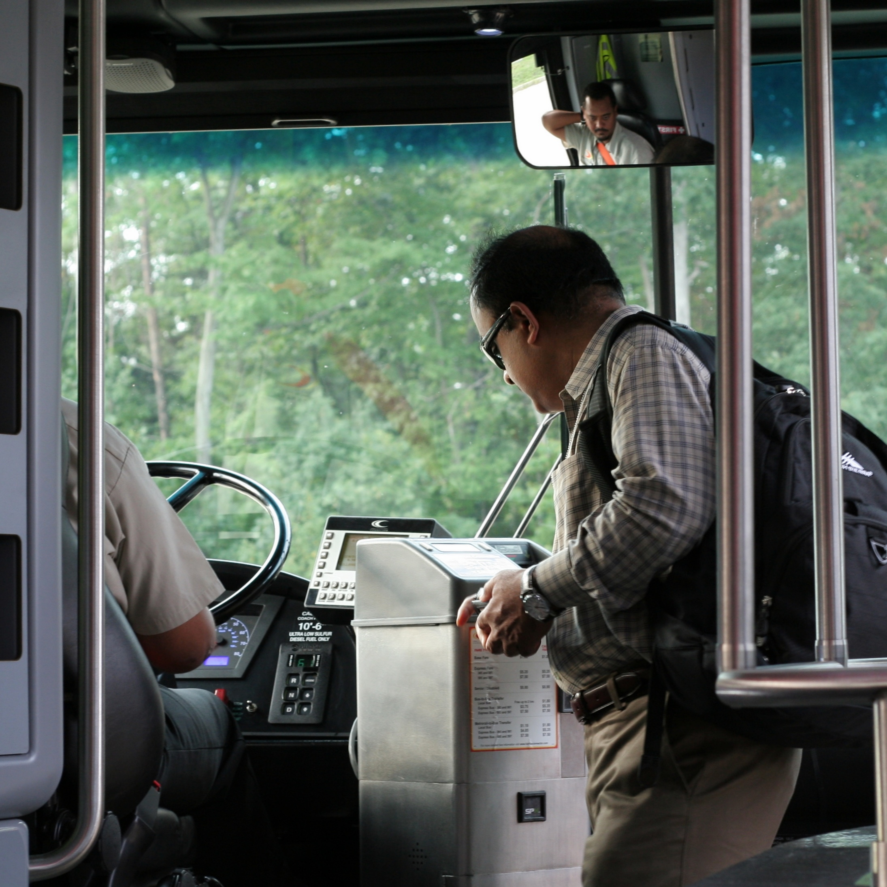
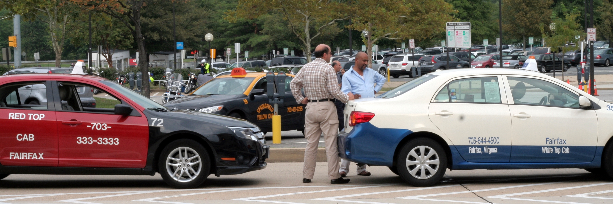
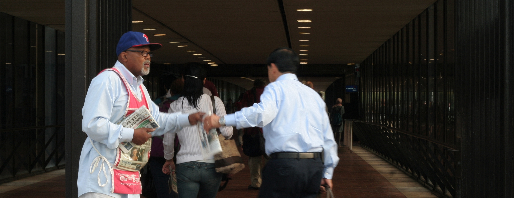
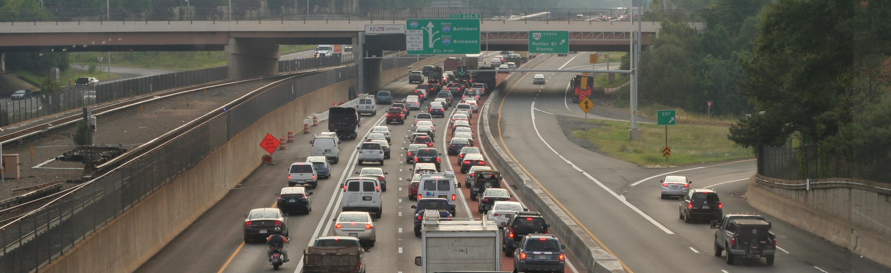
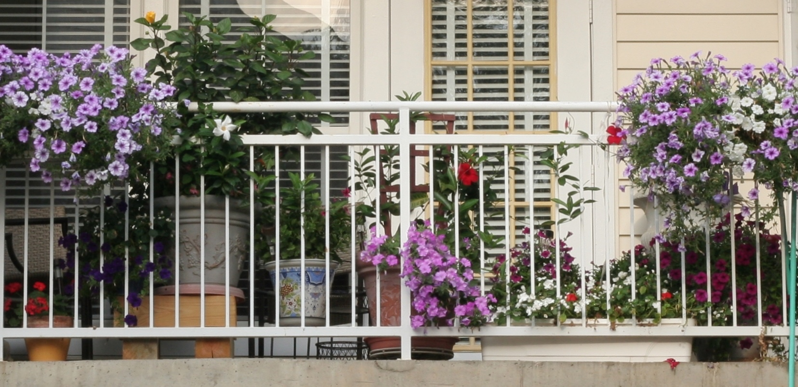
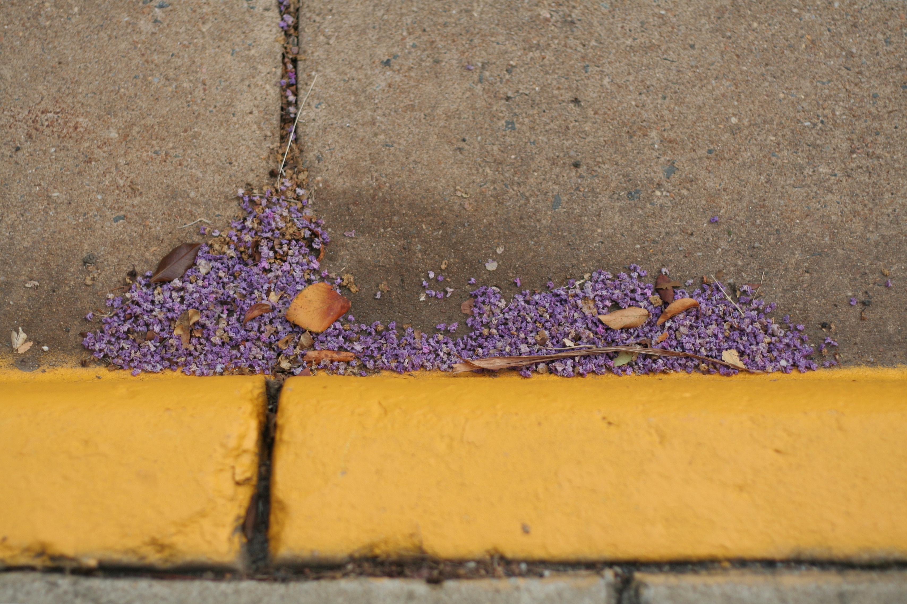
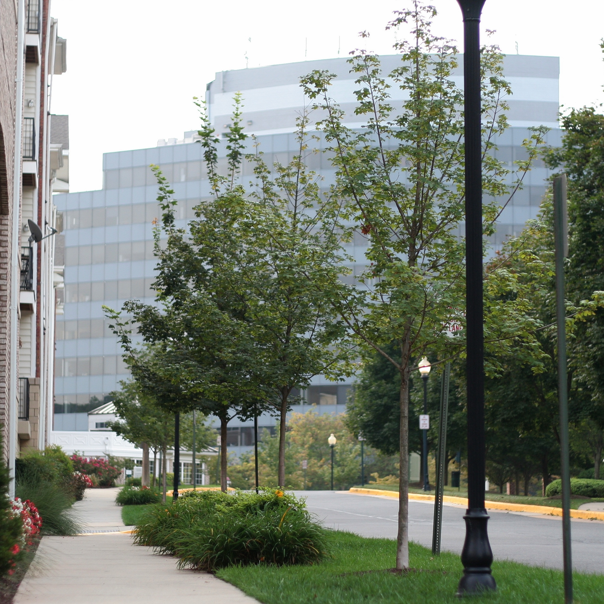

+++
title = "morning commute"
date = 2012-08-27
draft = false
tags = ["Around Town"]

[cover]
  image = "image-03.jpg"
  relative = true
+++

I push the broken storm door closed once, two, three times before it latches. I wave and blow kisses to my littles standing in the front window, turn, and make the short walk to my bus stop. I scan the headlines through the newspaper box glass and wait. The bus pulls up to the curb and I step through the open doors, climb the stairs, tap my commuter card to the fare machine, then take my usual seat. The bus threads its way down the narrow street and makes several stops, picking up small, orderly lines of people. The daily riders greet each other with the ease of the long-married, remarking on a new haircut, asking about the weekend, pointing out an uncharacteristic suit and tie in a teasing voice. Fifteen minutes later, we climb the HOV ramp to the highway. I close my eyes and [listen](http://www.youtube.com/watch?v=HN8shRyrtYY).

The other riders rise and stand in the aisle as soon as we exit the highway. The bus comes to a stop and the doors open. I step into the current and am carried past idling taxis and buckets of flowers to the pedestrian bridge. A newspaper is thrust into my hand and I float across a sea of red tail lights. Halfway down the tunnel the others turn toward the Metro gates, but I break free of the tide. I walk to the far end of the tunnel and emerge onto the street. I make my way down the hill and enter the housing development bordering my office campus. Most balconies are bare, but one is not. The streets are unswept, and the withered lilac blossoms release a sweet, stale fragrance as they are crushed under my Converse. I pass a long-haired cat sleeping on a concrete porch. I turn a corner and my office building stands grey against grey sky. I slip the lanyard of my employee badge around my neck as I pass through the glass entrance doors.
