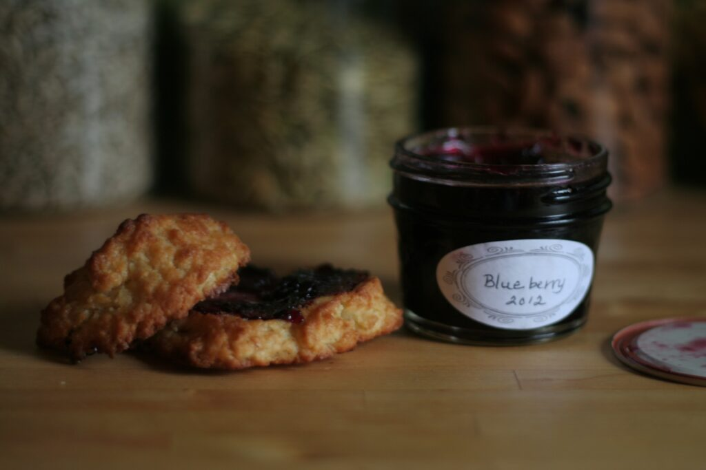

+++
title = "morning"
date = 2013-01-17
draft = false
tags = ["Food", "Home"]
+++

I lit a candle in the dark morning hours and sat in silence with my nine year-old. We stayed in the quiet for only five minutes and then the day had to begin. My favorite part of the morning: the kids and I singing [Looney Tunes words](https://vimeo.com/456078993) to the overture of Rossini’s Barber of Seville. Leftover drop biscuits held spoonfuls of homemade jam, or in some cases, small piles of Nutella.
