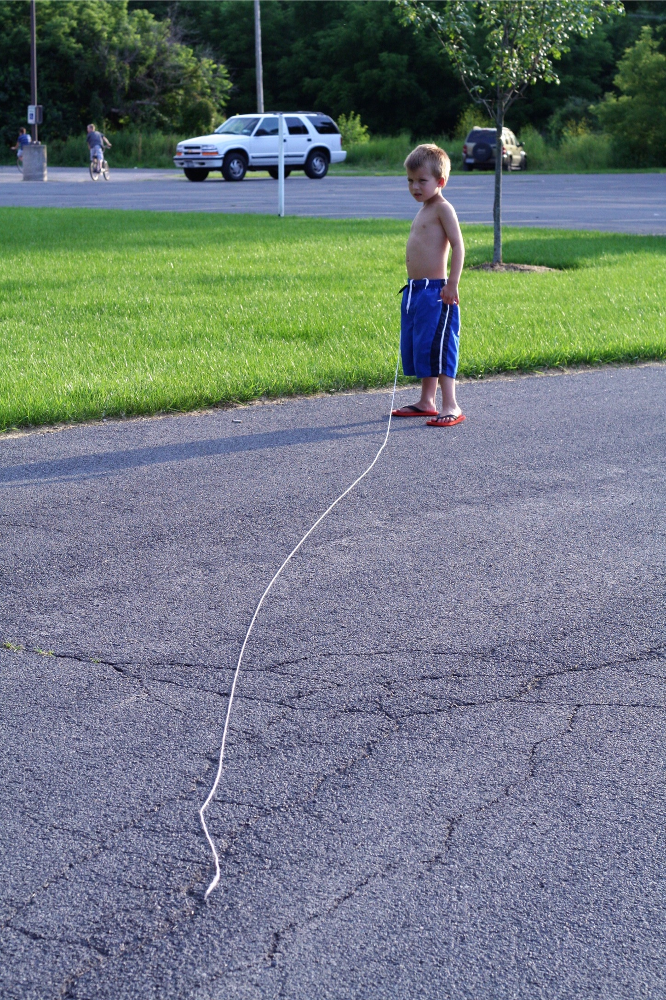
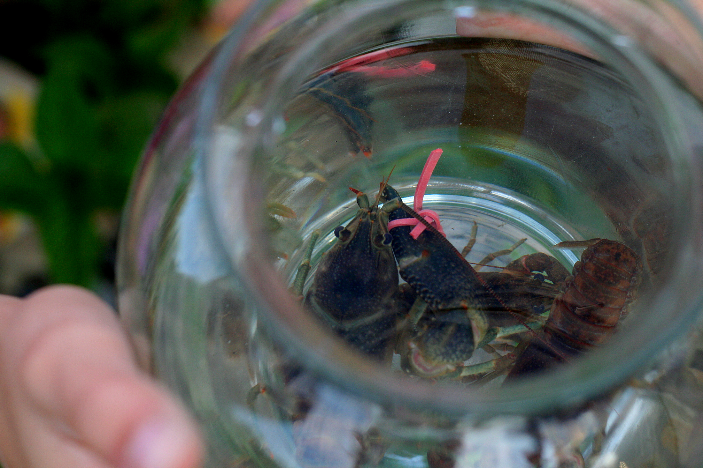
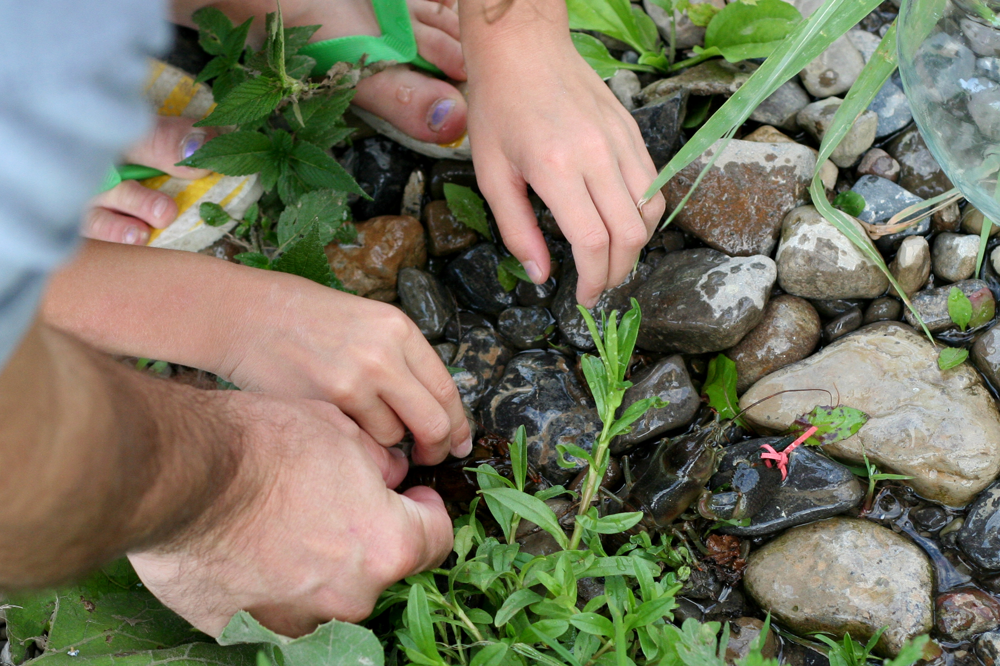

+++
title = "one must bring a very long string when releasing crayfish into the wild"
date = 2009-07-30
draft = false
tags = ["Family", "Outside"]

[cover]
  image = "image-01.jpg"
  relative = true
+++

