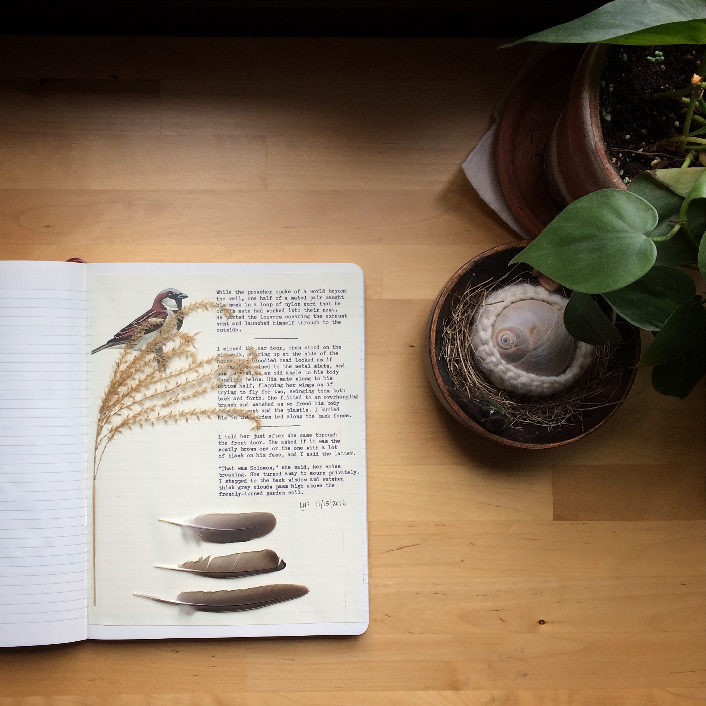

+++
title = "Passer domesticus"
date = 2016-11-15
draft = false
tags = ["Family", "Outside"]
+++

While the preacher spoke of a world beyond the veil, one half of a mated pair caught his neck in a loop of nylon cord that he or his mate had worked into their nest. He parted the louvers covering the exhaust vent and launched himself through to the outside.

I closed the car door, then stood on the sidewalk, staring up at the side of the house. His bloodied head looked as though it was glued to the metal slats, and was twisted at an odd angle to his body dangling below. His mate clung to his bottom half, flapping her wings as if trying to fly for two, swinging them both back and forth. She flitted to an overhanging branch and watched as we freed his body from the vent and the plastic. I buried him in the garden bed along the back fence.

I told her just after she came through the front door. She asked if it was the mostly brown one or the one with a lot of black on his face, and I said it was the latter.

“That was Solomon,” she said, her voice breaking. She turned away to mourn privately. I stepped to the back window and watched thick grey clouds pass high above the freshly turned garden soil.
