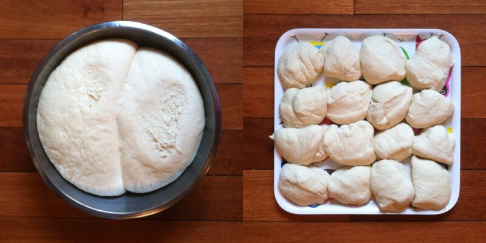

+++
title = "pizza for 16"
date = 2013-08-12
draft = false
tags = ["Food", "Friends"]
+++

I brought 16 balls of pizza dough, a big jar of my homemade [New York-style sauce](http://www.seriouseats.com/recipes/2010/10/new-york-style-pizza-sauce.html), and a jar of my spicy caramelized onion and hot cherry pepper mix to a friend’s house Sunday afternoon.

Pizza for 16 was quite a project. I slid pizza on and off of the hot stone for about two and a half hours, red-faced, hair piled high on my head and sweat trickling behind my apron. Lovely image, I know. I sipped on a glass of old vine Zin and chatted with lady friends while working. Children popped in and out of the sweltering kitchen to place their pizza orders and check on status. My pizza was last to come out of the oven. It was *delish*, if I may say so myself.
