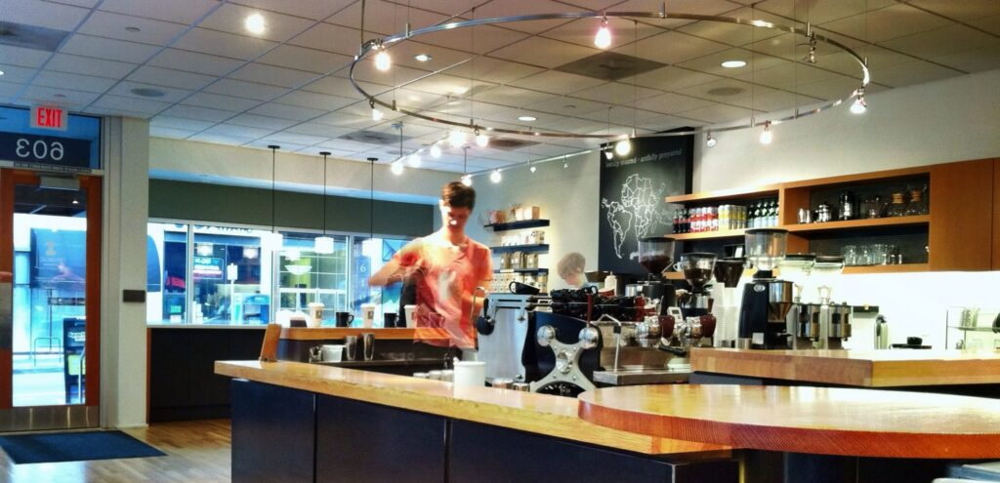
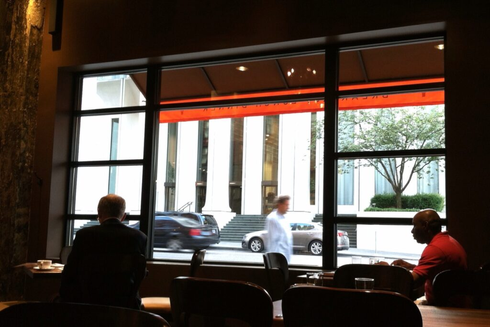

+++
title = "portland in july"
date = 2013-07-17
draft = false
tags = ["Travel"]
+++

Portland in July was a temperate, low humidity heaven on earth. Bungalows, restaurants, cape cods, bars, and flower shops are mixed together and spread out across the straight line of Southeast Division Street. I sat at a tiny outdoor table at [The Woodsman Tavern](http://woodsmantavern.com/), sipped a coa de jima and thought *if I lived in that little house across the street, this would be my regular haunt.*
