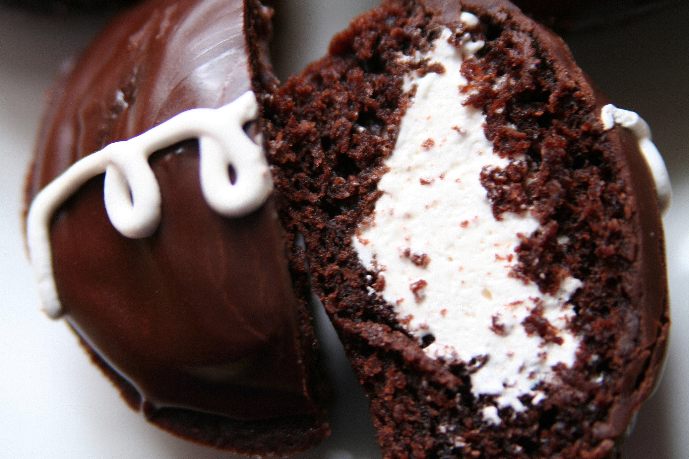

+++
title = "procrastination can be delicious, you know"
date = 2010-01-10
draft = false
tags = ["Food"]
+++

I use a sharp paring knife to remove a cone from the center of each cooled cake, the last step before filling each one with creamy, delicious, Fluff-based guts. Out of the corner of my eye, I see half-filled moving boxes in the living room, waiting their turn. Then the oven timer rings: the pizza dough is ready to divide and shape. At this rate, by the time this house is packed and [ready to go](https://laurafrantz.com//2010/01/three-weeks.html), I may no longer be able to fit into any of my jeans.
