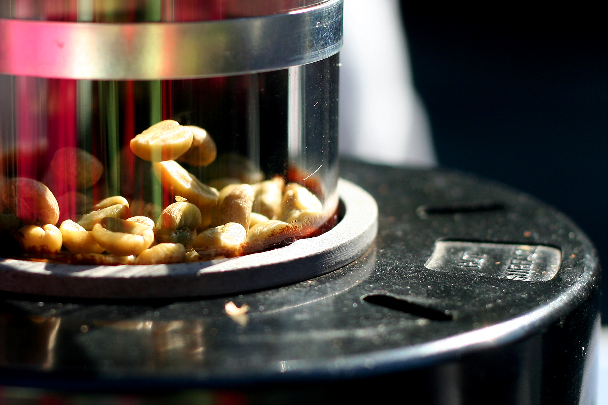
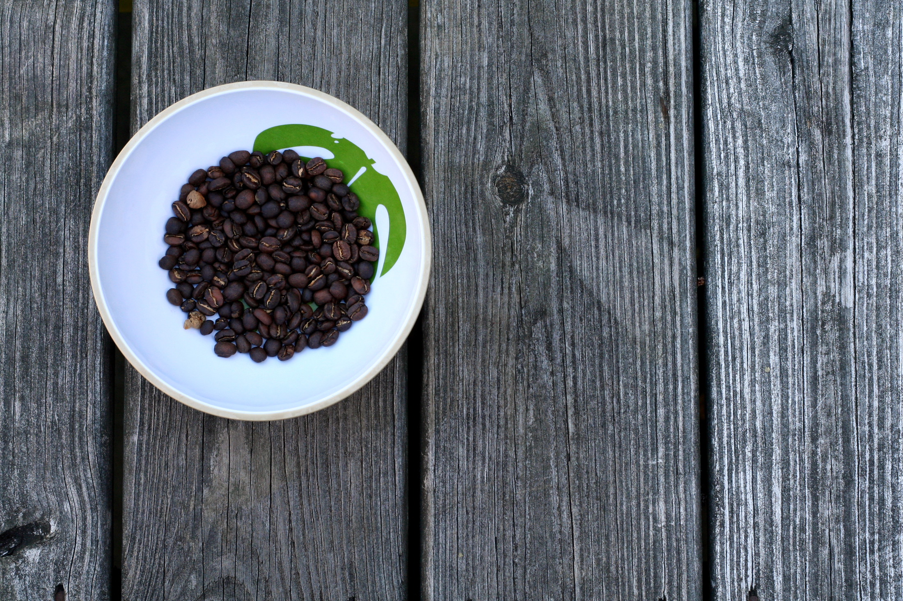

+++
title = "roasting coffee @ home"
date = 2009-09-22
draft = false
tags = ["Food"]
+++

Cooler weather brings the smell of green coffee beans roasting out on our back deck. We all wait quietly and listen for [first crack](http://www.sweetmarias.com/roasting-VisualGuideV2.php). The beans are best the day after roasting. And the coffee is smooth and delicious.
