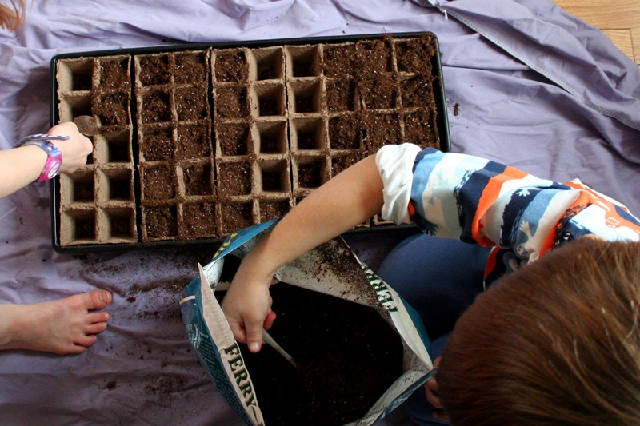
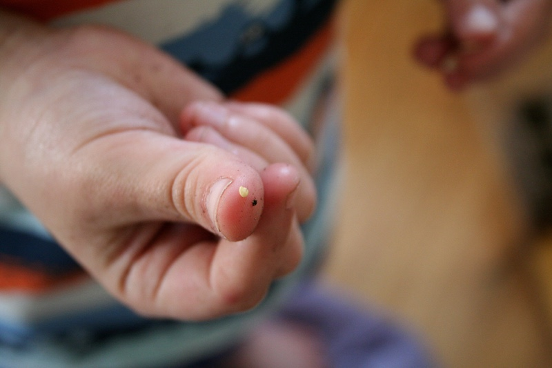
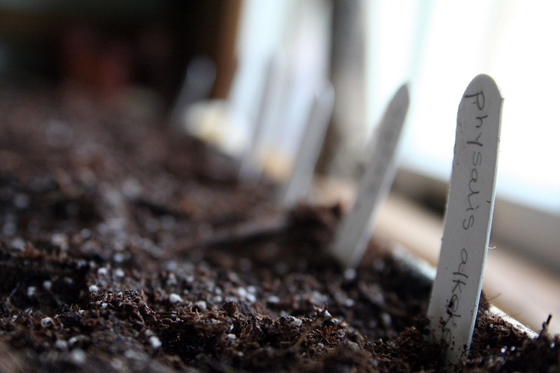

+++
title = "seeds"
date = 2014-03-16
draft = false
tags = ["Family", "Garden", "Home"]
+++

I bought a fluorescent light fixture with two full-spectrum grow bulbs and installed it in our basement pantry. I made pots out of newspaper and we planted seeds. I water them twice a day and imagine them tall and strong in the sunshine.
