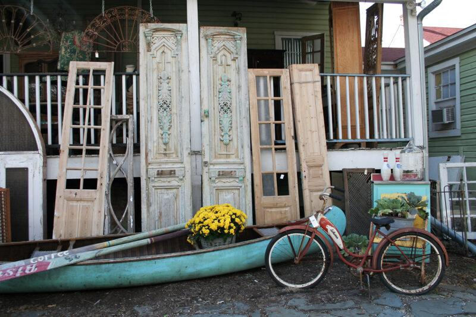
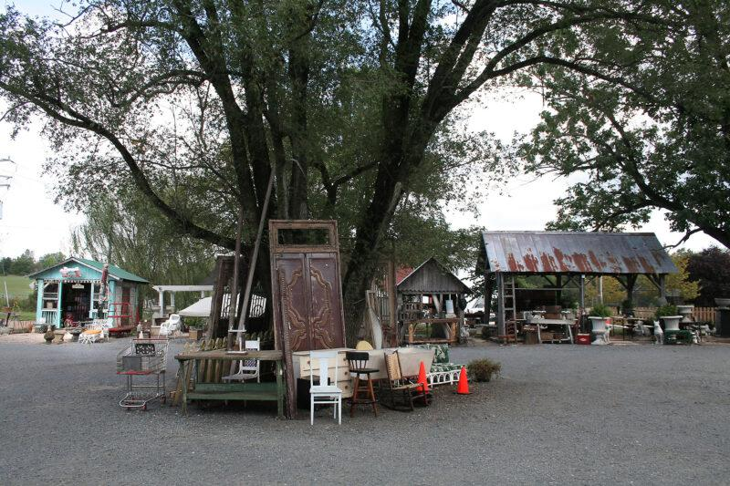
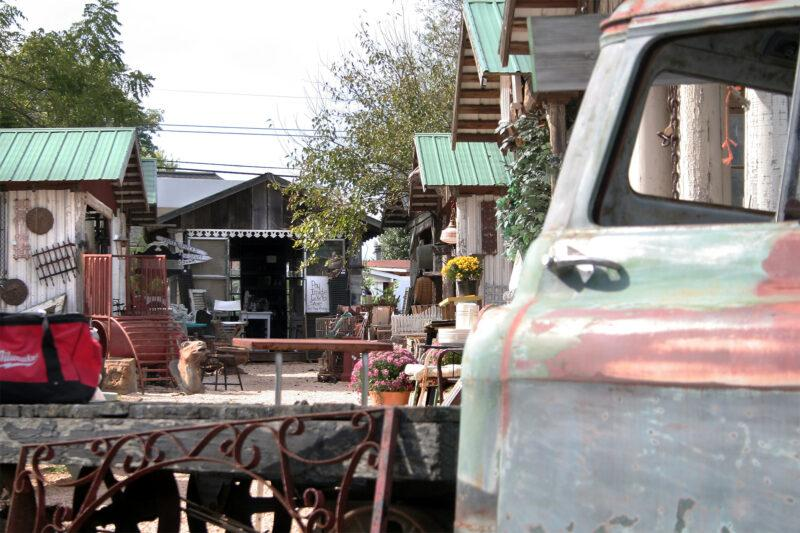
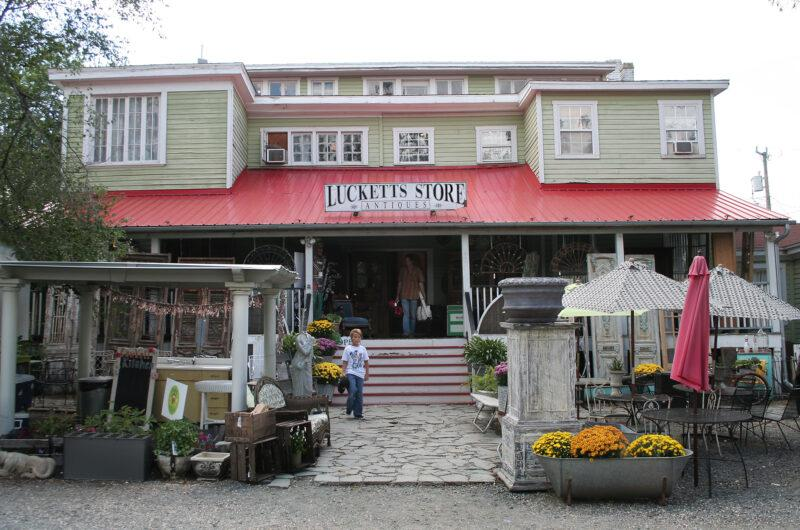
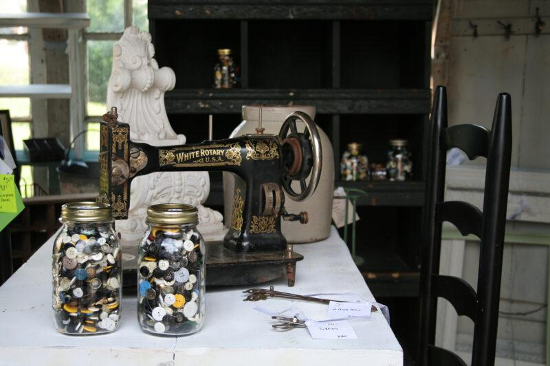

+++
title = "the old lucketts store"
date = 2014-09-17
draft = false
tags = ["Travel"]
+++

Thirty minutes before closing. The grounds are dotted with little houses, each one filled with whispering old objects.

Electric fans move the air inside the main building and I wander through three levels. A man browses through silverware on the ground floor. I see him again on the second floor, looking at a small wooden puzzle box. And then we’re on the third floor where the air is thin. We are spirits looking for lost possessions.

Eyes closed, my hand wraps around a small glass bottle that once held a tiny bouquet of buttercups.

All of the silver, all of the linen, all of the brass and the wood and the glass, every small and large thing wears a fragile coating of dust and soul and each thing wonders\
*who will ever love me again*
