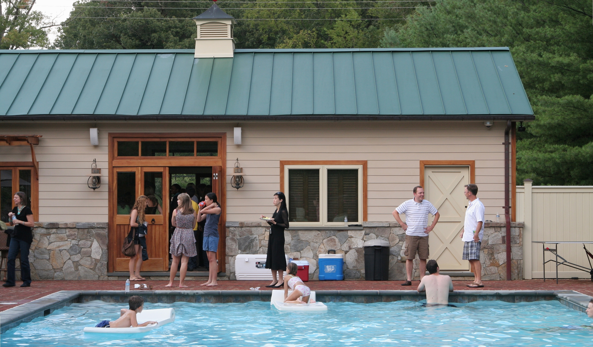
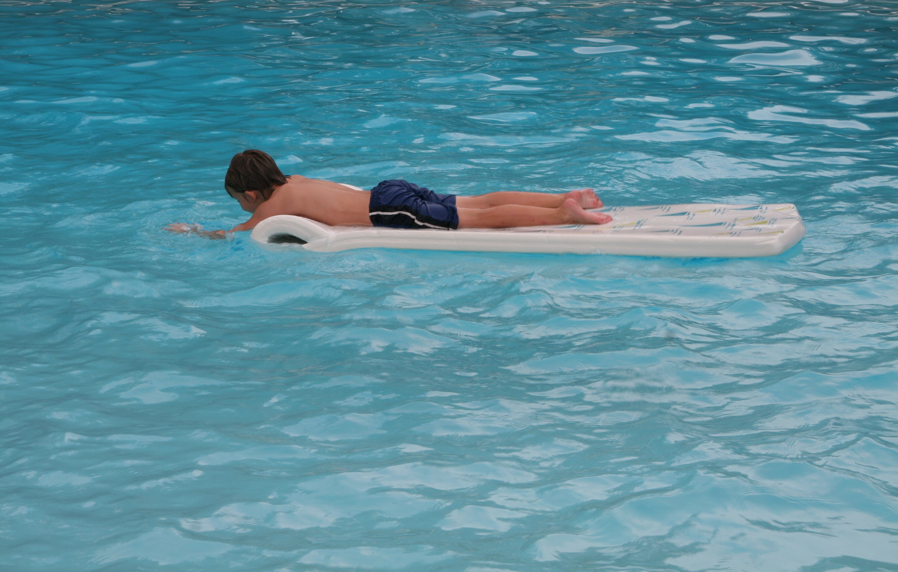

+++
title = "the wrap party"
date = 2012-09-07
draft = false
tags = ["Friends"]

[cover]
  image = "image-01.jpg"
  relative = true
+++

I keep my distance, as usual, camera as buffer and coping mechanism. The cast and crew of [my friend’s film](https://www.facebook.com/SeniorPranktheMovie) are called into the poolhouse in groups to watch behind-the-scenes clips on his laptop. The kids steer chunky white rafts around the water. I am called to bear witness to a ritual that is strange to me, but apparently is a very traditional part of this sort of celebration: the throwing of the directors into the pool. I ask no questions, just lift my lens and get the shots, pleased that I chose photography over movie-making.
