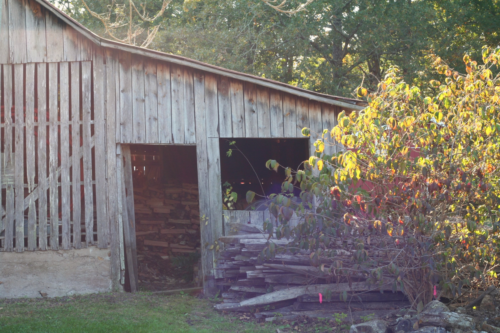
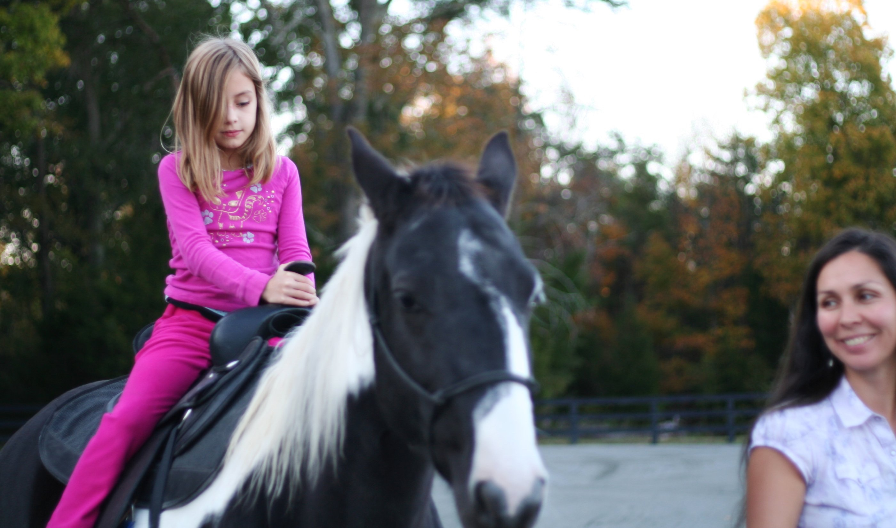
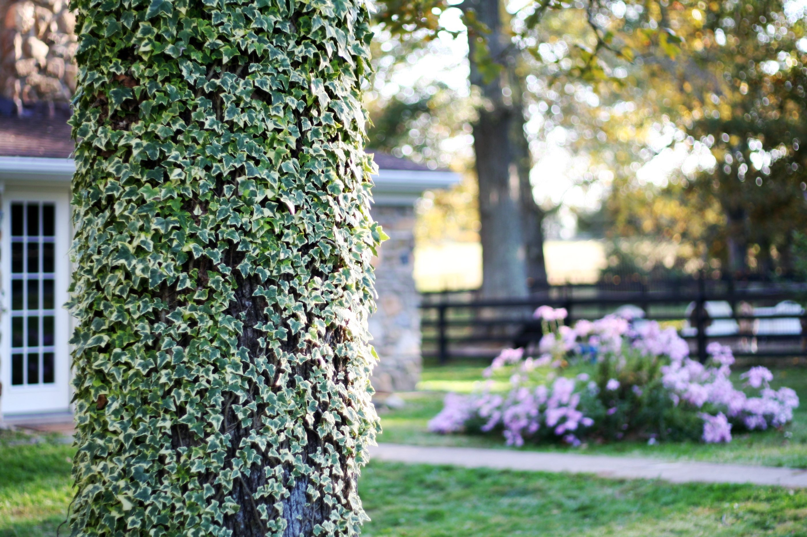
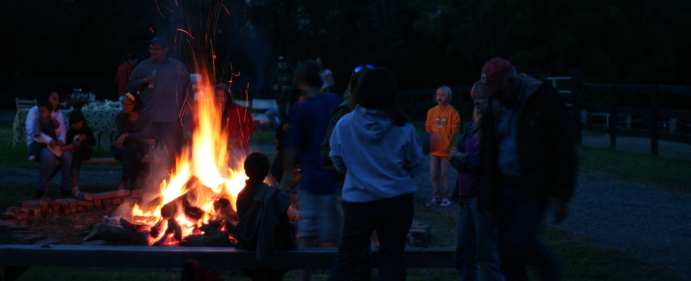
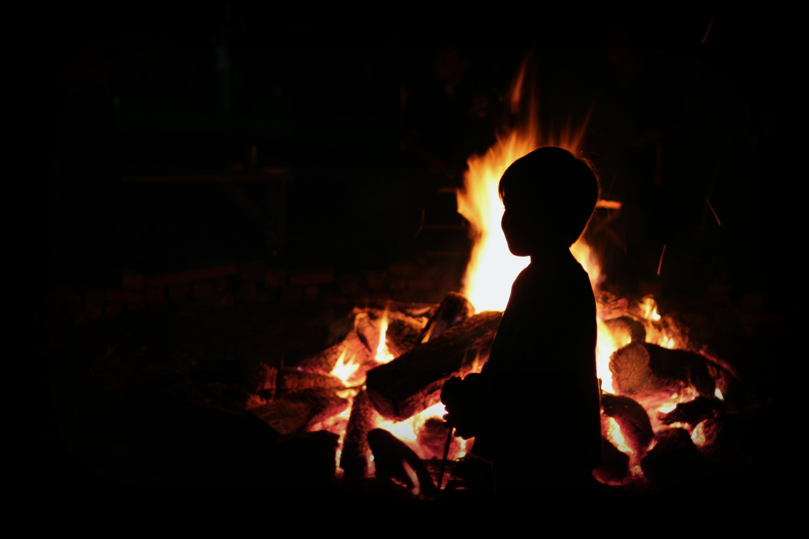

+++
title = "woods edge"
date = 2010-11-02
draft = false
tags = ["Family", "Friends", "Occasions", "Outside"]

[cover]
  image = "image-03.jpg"
  relative = true
+++

A sign hangs at the beginning of the long driveway, but I only catch the first word, *Woods*, white painted letters on dark pine. We pass fenced pastures dotted with small barns and stands of tall trees, only tufts of orange and brown leaves left at their very tops, their bodies spare streaks below. The horses lift their heads as we pass. We park under an old maple and haul folding chairs, blankets, and backpacks holding flashlights and sweatshirts past the farm house and into the back yard where the gathering has started.

This is Angelina’s farm. She is a former lawyer turned farm-owner. Her long, black hair hangs down her back, almost brushing her thick leather belt. Many of her family are here, and friends, and friends of friends like we are, standing around the food tables or sitting in small groups. Children run through and between the barns, jump into the leaf piles and then pull poking leaf bones from their hair and pockets. The sun hangs low. Thick rays skim the tops of the dry branches piled high in the fire pit. The air smells of horse and hay, salad dressing and vegetable stew, grass and sun-warmed wood.

We eat and laugh. The men pick up guitars and try out a tune or two. The grey mare gives rides to the little ones, circling in the pea gravel until the passing three wheeler spooks her to a standstill. The sky deepens and the barn darkens as the children take turns swinging blindly at a pinata hanging from a cross beam. One final *crack* of the broom handle and candy pours from the fatal wound onto the cement floor.

The moon is round and orange. The sweet mares whinny for attention and carrots from their fences. We sit near the fire and watch the bats make laps around the horse barn, passing in front of the floodlight with each go-around. We circle little limbs and pull blanket corners down and around body edges. A flashlight hunt for a lost belonging takes place in the giant leaf pile; we hear a shout of victory and know that what was once lost is now found. Sparks fly upward.

