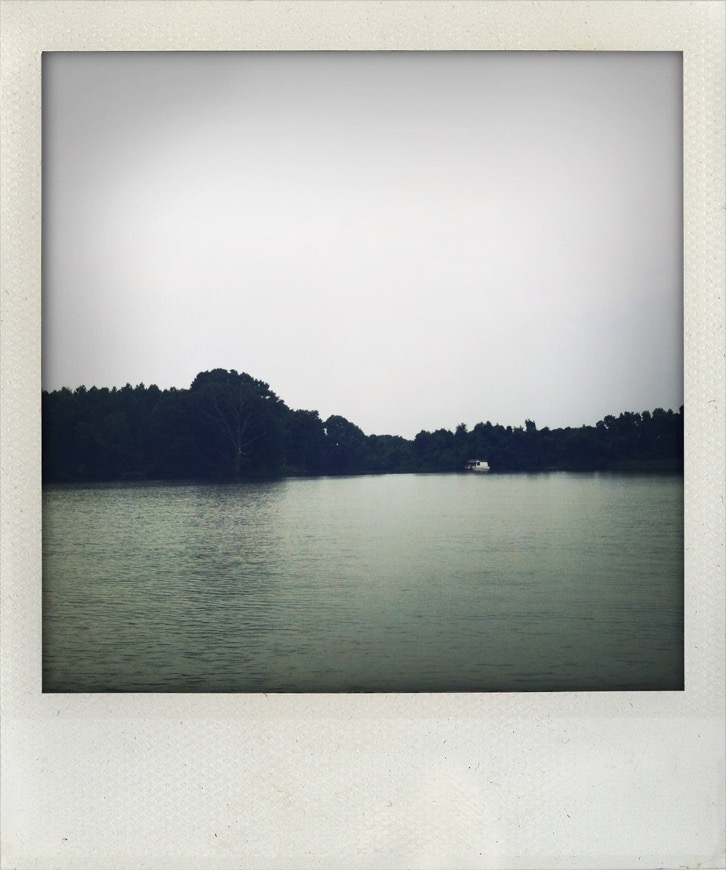

+++
title = "wye river"
date = 2013-08-05
draft = false
tags = ["Family", "Travel"]
+++

I stand on the deck of the boat, brow furrowed against whipping hair, wind lashing my back.

I watch my heart trampoline hard on the wake, tethered to me with the thinnest rope.

He swings wide, an inked stylus recording a round swell of current, then jerks left and right, scratching thick and black the sharp spikes of my fear. A final jolt, and he slips under the dark water.

Later, we thump hard and fast back to the marina.\
His brown skin glows a life vest orange,\
his blue eyes closed against fat rain drops.\
He scratches his jellyfish stings.
